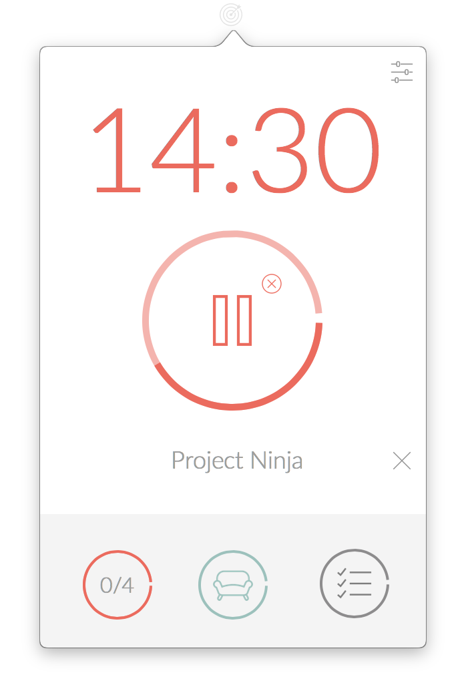

# Focusin

Get stuff done and be more productive by applying the [Pomodoro Technique](http://pomodorotechnique.com). Build in Swift.

Download it at [http://focusin.albertoquesada.com](http://focusin.albertoquesada.com)

## Features
- Native system alerts
- Customizable settings
- Beautiful and minimalistic design
- Menu bar only
- Track your top three tasks.

## License

Focusin is licensed under the MIT license. © [Alberto Quesada](http://albertoquesada.com)
